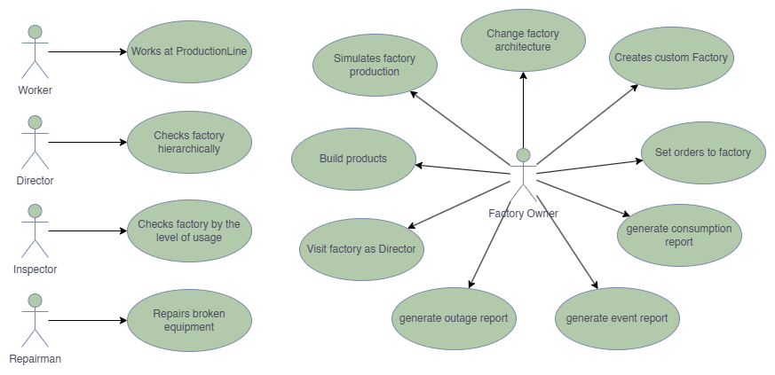
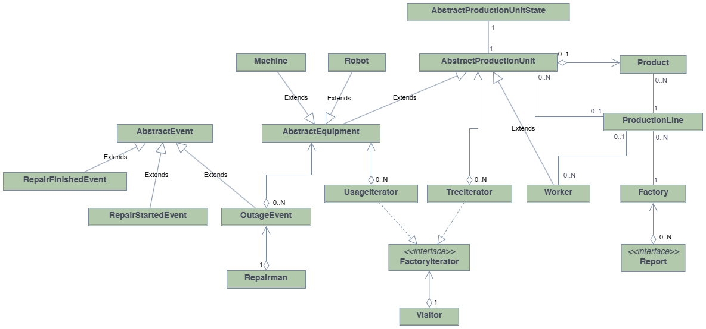
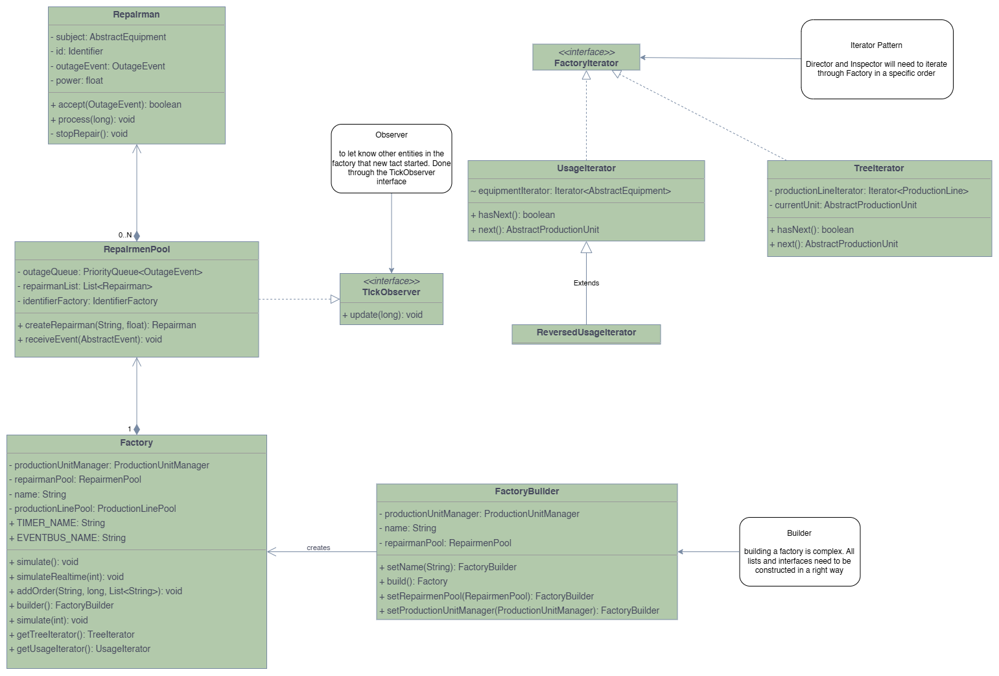
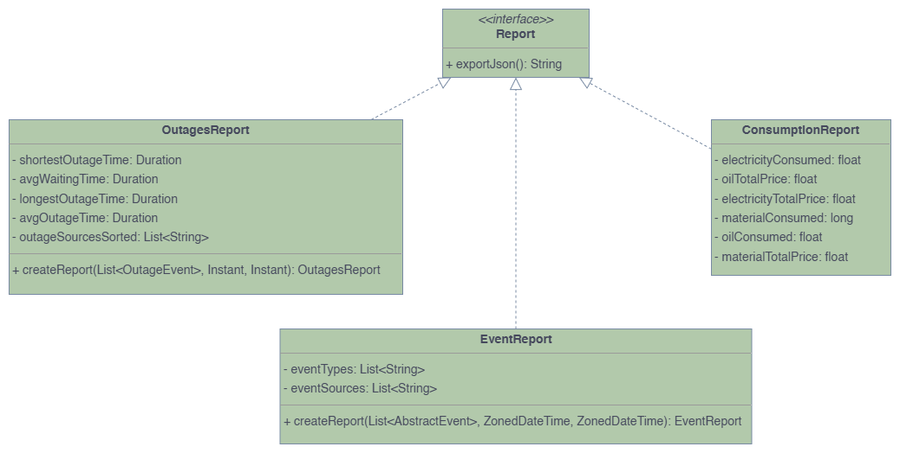
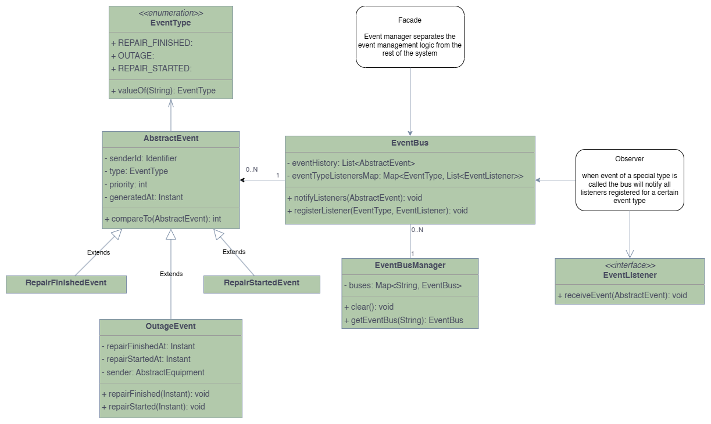
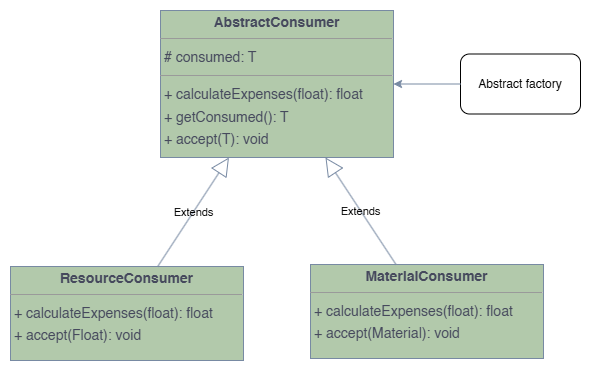
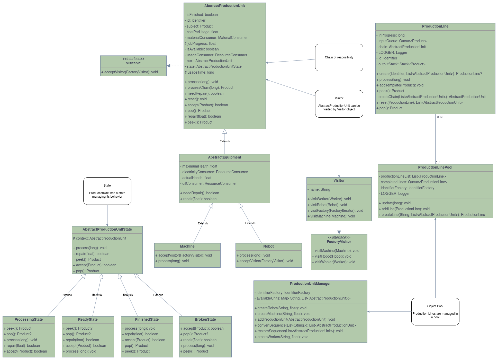
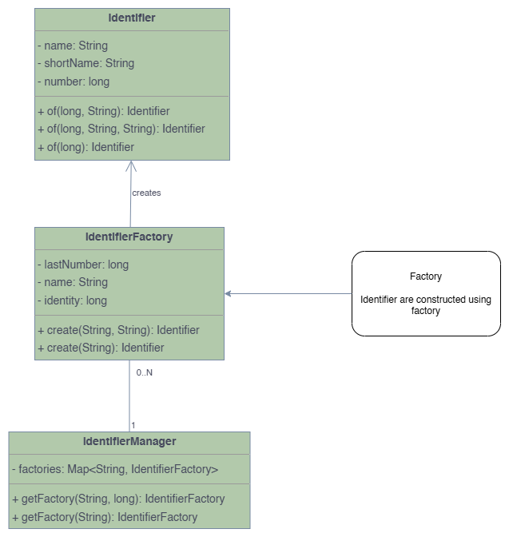
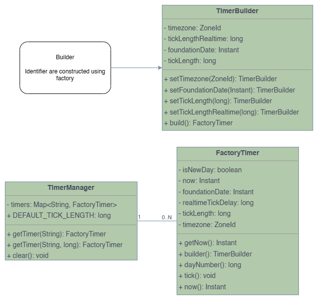
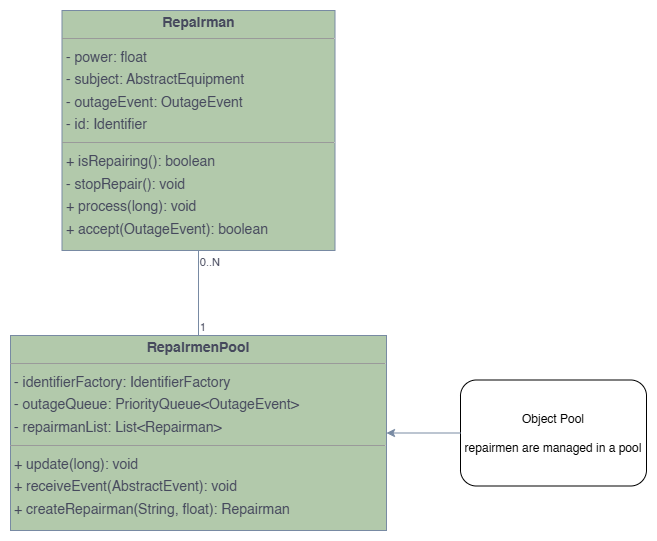

# Semester project Smart Factory

## Abstrakt

Vytvořit aplikaci pro virtuální simulaci inteligentní továrny, kde simulujeme chod výroby - na výrobních linkách s
pomocí strojů a lidí vyrábíme produkty. Používáme jednotlivé stroje a vyhodnocujeme jejich využití, spotřebu a kvalitu
výsledných výrobků. Součástí výrobního procesu jsou nejen stroje a lidé, ale i kolaborativní roboty. Základní časová
jednotka je jeden takt (trvá jednu hodinu). Stavy továrny se mění (a vyhodnocují) po těchto taktech.

## Funkční požadavky

* F1. Hlavní entity se kterými pracujeme je továrna, linka (s prioritou), stroj, člověk a výrobek, materiál plus
  libovolné další entity. Stroje, lidé i výrobky mohou být různého druhu.
* F2. Produkty se vyrábějí v sériích po několika stech kusů, jestliže se mění série nekompatibilních výrobků, tak je
  potřeba výrobní linky přeskládat. Každý výrobek má definovanou sekvenci zařízení, robotů, lidí, které je potřeba za
  sebou uspořádat na linku.
* F3. Stroje a roboty mají svoji spotřebu; lidé, roboty, stroje i materiál stojí náklady.
* F4. Komunikace mezi stroji, roboty a lidmi probíhá pomocí eventů. Event může dostat 1 až N entit (člověk, stroj,
  robot), které jsou na daný druh eventu zaregistrované. Eventy je potřeba odbavit.
* F5. Jednotlivá zařízení mají API na sběr dat o tomto zařízení. O zařízeních sbíráme data jako je spotřeba elektřiny,
  oleje, materiálu a funkčnost (opotřebení roste s časem).
* F6. Stroje a roboty se po určité době rozbijí. Po rozbití vygenerují event (alert) s prioritou podle důležitosti
  linky, který odbaví člověk - opravář.
* F7. Opravářů je omezený počet. Oprava trvá několik taktů. Při začátku opravy a konci opravy je generován event (bude
  se hodit pro požadavek F10 :-). Vznikají situace, kdy nejsou dostupní žádní opraváři - pak se čeká dokud se některý z
  nich neuvolní. Po uvolnění opravář nastupuje na 1. nejprioritnější, 2. nejstarší defekt.
* F8. Návštěva ředitele a inspektora. Realizujeme návštěvu továrny, kdy ředitel prochází továrnou přesně podle stromové
  hierarchie entit továrna ->* linka -> *(stroj|robot|člověk nebo výrobek) a inspektor prochází podle míry opotřebení.
  Ředitel i inspektor mají na sobě definované akce, které provedou s daným typem entity. Zapište sekvenci procházení a
  názvy provedených akcí do logu.
* F9. Za továrnu je nutné vygenerovat následující reporty za libovolné časové období:
    * FactoryConfigurationReport: veškerá konfigurační data továrny zachovávající hierarchii - továrna ->* linka -> *(
      stroj|robot|člověk nebo výrobek).
    * EventReport: jaké za jednotlivé období vznikly eventy, kde je grupujeme 1) podle typu eventu, (2) podle typu
      zdroje eventu a (3) podle toho, kdo je odbavil.
    * ConsumptionReport: Kolik jednotlivé zařízení, roboty spotřebovaly elektřiny, oleje, materiálu. Včetně finančního
      vyčíslení. V reportu musí být i summární spotřeby za nadřazané entity (linka|továrna)
    * OuttagesReport: Nejdelší výpadek, nejkratší výpadek, průměrná doba výpadku, průměrná doba čekání na opraváře a
      typy zdrojů výpadků setříděné podle délky výpadku.
* F10. Vraťte stavy strojů v zadaném taktu (jiném než posledním :-)). Stav zrekonstruujte z počátečního stavu a sekvence
  eventů, které byly na stroji provedeny.

## Nefunkční požadavky

* Není požadována autentizace ani autorizace
* Aplikace může běžet pouze v jedné JVM
* Aplikaci pište tak, aby byly dobře schované metody a proměnné, které nemají být dostupné ostatním třídám. Vygenerovný
  javadoc by měl mít co nejméně public metod a proměnných.
* Reporty jsou generovány do textového souboru
* Konfigurace továrny může být nahrávána přímo z třídy nebo externího souboru (preferován je json)

# Analýza

Táto časť dokumentácie sa zaoberá analýzou softvéru pomocou diagramov UML, ktoré poskytujú prehľad o architektúre nášho
systému.
Diagramy zobrazujú štruktúru hlavných komponentov, ich vzájomné vzťahy a interakcie, ktoré umožňujú splnenie požiadaviek
na
funkčnosť.

## Use Cases

Dole je náš Use Case diagram, ktorý znázorňuje hlavných aktérov a jednotlivé prípady použitia (use cases), ktoré náš
softvér poskytuje.
Diagram poskytuje prehľad o tom, ako používateľské role interagujú so systémom, a definuje hlavné funkcionality dostupné
pre každého aktéra.
Tento diagram slúži ako základ pre pochopenie používateľských požiadaviek.

## Architektura

Najobecnejším diagramom nášho projektu je overview diagram, ktorý poskytuje vysokú úroveň pohľadu na návrh nášho
softvéru.
Tento diagram zobrazuje základné komponenty systému a ich vzájomné prepojenia, čím poskytuje ucelený prehľad o
architektúre a hlavných funkčných častiach softvérového riešenia.

Prvá časť systému, na ktorú sa zameriame, je Factory a jej priradené entity.
Táto entita je stredobodom celej aplikácie a predstavuje abstraktnú reprezentáciu skutočnej továrne.

Ďalšou časťou systému sú reporty, ktoré je možné generovať pre ľubovoľnú továreň a za ľubovoľné časové obdobie.
Reporty poskytujú prehľad o výkonnosti a aktivitách systému prostredníctvom zberu a spracovania relevantných údajov.

Ďalšou časťou systému je event management. Tento modul umožňuje spravovať udalosti (events) v rámci továrne.
Naša továreň poskytuje mechanizmus, v ktorom je možné spúšťať eventy a registrovať sa na ich počúvanie.

Consumer je časť systému zodpovedná za zachytávanie spotreby v našej továrni.
Tento modul monitoruje a spravuje procesy, ktoré súvisia s využívaním a odoberaním zdrojov generovaných systémom.

Teraz sa zameriame na časť systému, ktorá spravuje výrobné jednotky a zariadenia.
Tento modul je zodpovedný za výrobu produktov v továrni a zabezpečuje efektívne riadenie výrobných procesov.
Spravuje rôzne výrobné zariadenia, ktoré sú nevyhnutné na výrobu produktov, a optimalizuje ich využitie na základe
aktuálnych požiadaviek a dostupných zdrojov.

V továrni sa jednotlivé objekty rozlišujú pomocou identifikátora (identifier), ktorý slúži na jednoznačnú identifikáciu
každého objektu v systéme.
Tento identifikátor je kľúčovým prvkom pri správe a manipulácii s objektmi v továrni, pretože zabezpečuje, že každý
objekt je unikátny a ľahko rozpoznateľný v rámci celkového systému.
Dole je ukázaná jeho implementácia, ktorá demonštruje spôsob, akým je identifikátor priradený a používaný v rámci
objektov továrne.

Tiky v továrni sú realizované pomocou Factory Timer.
Tento komponent je zodpovedný za správu časových intervalov a spúšťanie rôznych akcií alebo procesov v rámci továrne na
základe časových podmienok.

Časť systému, ktorá je zodpovedná za realizáciu opráv, je zobrazená dole.
Tento modul sa stará o správu opravarov a priraďovanie chýb na opravu. Zabezpečuje koordináciu medzi opravármi a
systémom.

